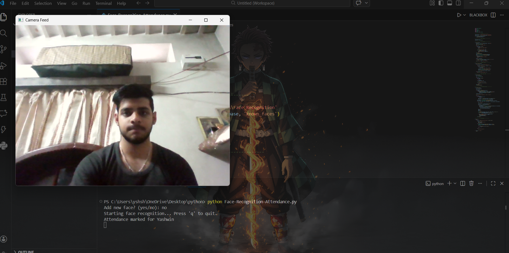
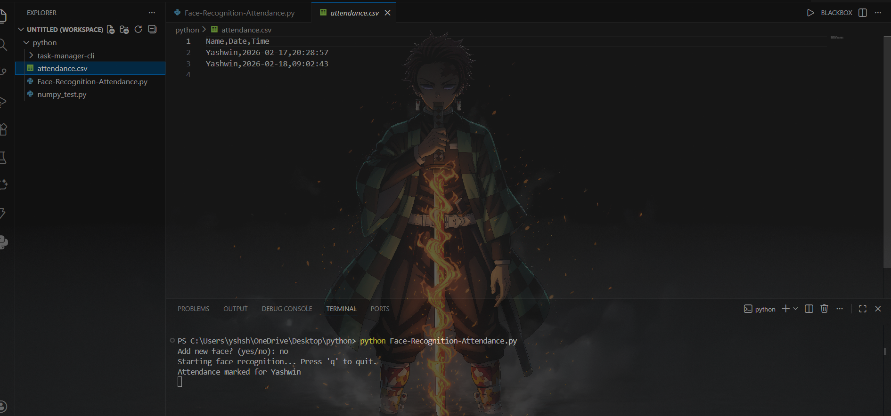

# 🎯 Face Recognition Attendance System

A real-time face recognition based attendance system built using **Python, OpenCV, and the face_recognition library**.

This system captures live webcam input, detects faces, compares them against stored encodings, and automatically logs attendance into a CSV file — while preventing duplicate entries for the same session.

Designed with modular architecture, threading, and improved recognition accuracy.

---

## 🚀 Features

- Real-time face detection and recognition
- Dynamic face registration using webcam
- Face encodings stored locally for reuse
- CSV-based automatic attendance logging
- Duplicate attendance prevention per session
- Portable directory structure (no hardcoded paths)
- Threaded camera and recognition system
- Improved recognition accuracy using distance thresholding

---

## 🛠 Technologies Used

- Python 3
- OpenCV
- face_recognition (dlib)
- NumPy
- Threading
- CSV module

---

## 📂 Project Structure

Face_Recognition_Attendance.py
known_faces/
attendance.csv
requirements.txt

---

## ▶ How to Run

1. Clone this repository:

git clone https://github.com/your-username/face-recognition-attendance-system.git

2. Navigate into the folder:

cd face-recognition-attendance-system

3. Install dependencies:

pip install -r requirements.txt

4. Run the program:

python Face_Recognition_Attendance.py

Press **'q'** to quit camera.

---

## 📌 How It Works

1. Faces are registered using webcam capture.
2. Encodings are generated using `face_recognition`.
3. During live feed:
   - Faces are detected
   - Encodings compared
   - Best match selected using minimum distance
4. If match confidence passes threshold:
   - Attendance is written to CSV
   - Duplicate entries are prevented

---

## 📊 Sample Attendance Output

Name,Date,Time
Yashwin,2026-02-17,20:28:57

---

## 📸 Demo

### Camera Feed

### Attendance Output

---

## 👨‍💻 Author

**Yashwin Kumar Sharma**  
Python Developer | AI & Backend Enthusiast  
Building real-world CLI and ML projects

---

